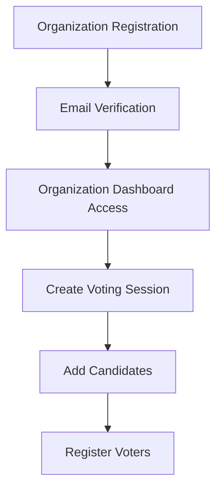
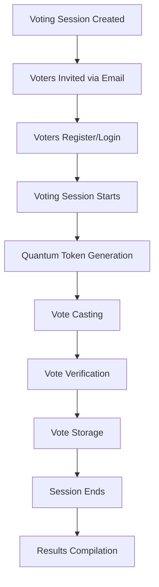
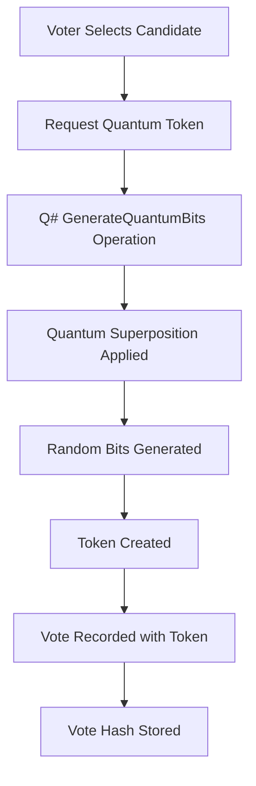
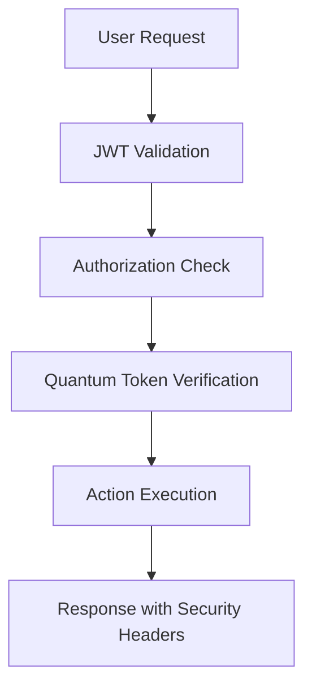

# Quantum Voting System

A secure and transparent voting system that leverages quantum computing principles to ensure vote integrity and anonymity. This application combines classical web technologies with quantum algorithms to create a tamper-resistant electronic voting platform.

## Table of Contents

- [Overview](#overview)
- [Features](#features)
- [Technology Stack](#technology-stack)
- [Architecture](#architecture)
- [Application Flow](#application-flow)
- [Getting Started](#getting-started)
- [API Endpoints](#api-endpoints)
- [Quantum Operations](#quantum-operations)
- [Security Features](#security-features)
- [Contributing](#contributing)
- [License](#license)

## Overview

The Quantum Voting System is designed to address the security and transparency challenges in electronic voting. By integrating quantum computing algorithms with traditional web technologies, this system provides:

- **Quantum-secured vote tokens** for enhanced security
- **Transparent voting process** with quantum verification
- **Multi-organizational support** for various types of elections
- **Real-time vote tracking** and result compilation
- **Anonymity preservation** through quantum randomization

## Features

### Core Functionality

- ✅ **Multi-Organization Support**: Organizations can create and manage their own voting sessions
- ✅ **Voter Registration**: Secure voter registration with email verification
- ✅ **Quantum Token Generation**: Each vote is secured with quantum-generated tokens
- ✅ **Real-time Voting**: Live voting sessions with time-bound access
- ✅ **Result Compilation**: Automatic vote counting and result generation
- ✅ **Authentication & Authorization**: JWT-based secure access control

### Security Features

- 🔐 **Quantum Randomization**: Uses quantum superposition for generating unpredictable vote tokens
- 🔐 **Hash-based Vote Storage**: Secure vote storage with cryptographic hashing
- 🔐 **Time-bound Sessions**: Voting sessions with strict start/end time enforcement
- 🔐 **Anonymous Voting**: Voter identity protection through quantum obfuscation

## Technology Stack

### Backend

- **ASP.NET Core 9.0** - Web API framework
- **Entity Framework Core** - ORM for data access
- **SQL Server** - Primary database
- **JWT Authentication** - Secure token-based authentication

### Quantum Computing

- **Q# (Q Sharp)** - Quantum programming language
- **Microsoft Quantum Development Kit** - Quantum operations and simulation

### Additional Tools

- **AutoMapper** - Object mapping
- **BCrypt** - Password hashing
- **SendGrid/SMTP** - Email services

## Architecture

The system follows a clean architecture pattern with clear separation of concerns:

```
┌─────────────────┐    ┌─────────────────┐    ┌─────────────────┐
│   Controllers   │────│    Services     │────│  Repositories   │
└─────────────────┘    └─────────────────┘    └─────────────────┘
         │                       │                       │
         │                       │                       │
┌─────────────────┐    ┌─────────────────┐    ┌─────────────────┐
│      DTOs       │    │   Quantum       │    │   Database      │
│                 │    │   Operations    │    │   (SQL Server)  │
└─────────────────┘    └─────────────────┘    └─────────────────┘
```

## Application Flow

### 1. Organization Setup



### 2. Voting Session Lifecycle



### 3. Quantum Vote Process



### 4. Detailed Application Flow

#### Phase 1: System Setup

1. **Organization Registration**
   - Organization admin creates account
   - Email verification required
   - Organization profile setup

2. **Voting Session Creation**
   - Define election title and description
   - Set voting date and time bounds
   - Configure election parameters

#### Phase 2: Election Preparation

3. **Candidate Management**
   - Add candidates to the voting session
   - Upload candidate information and photos
   - Validate candidate eligibility

4. **Voter Registration**
   - Organization invites eligible voters
   - Voters receive email invitations
   - Voters create accounts or login
   - Voter verification process

#### Phase 3: Voting Process

5. **Session Activation**
   - Voting session becomes active at scheduled time
   - Voters can access the voting interface
   - Quantum systems initialized

6. **Vote Casting**
   - Voter authenticates and accesses ballot
   - Voter selects preferred candidate
   - System triggers quantum token generation:

     ```
     User Selection → Quantum Service → Q# Operation → Random Token
     ```

7. **Quantum Token Generation**
   - Q# `GenerateQuantumBits` operation creates random bits
   - Quantum superposition ensures true randomness
   - Unique token generated for each vote
   - Token linked to vote but not to voter identity

8. **Vote Storage**
   - Vote recorded with quantum token
   - Cryptographic hash generated
   - Anonymous storage ensures voter privacy
   - Vote verification completed

#### Phase 4: Results and Verification

9. **Session Closure**
   - Voting automatically closes at end time
   - No new votes accepted
   - Final vote count initiated

10. **Results Compilation**
    - Votes tallied by candidate
    - Quantum tokens verified for authenticity
    - Results generated and displayed
    - Audit trail maintained

### 5. Security Flow



## Getting Started

### Prerequisites

- .NET 9.0 SDK
- Microsoft Quantum Development Kit
- SQL Server (LocalDB or full instance)
- Visual Studio 2022 or VS Code with Q# extension

### Installation

1. **Clone the repository**

   ```bash
   git clone https://github.com/your-org/quantum-voting-system.git
   cd quantum-voting-system
   ```

2. **Setup Database**

   ```bash
   cd Api
   dotnet ef database update
   ```

3. **Configure Settings**
   Update `appsettings.json` with your database connection string and email settings.

4. **Run the Application**

   ```bash
   dotnet run --project Api
   ```

5. **Access the API**
   - Swagger UI: `https://localhost:5001/swagger`
   - API Base URL: `https://localhost:5001/api`

## API Endpoints

### Authentication

- `POST /api/auth/login` - User login
- `POST /api/auth/register` - User registration

### Organizations

- `GET /api/organizations` - Get all organizations
- `POST /api/organizations` - Create organization
- `PUT /api/organizations/{id}` - Update organization
- `DELETE /api/organizations/{id}` - Delete organization

### Voting Sessions

- `GET /api/voting-sessions` - Get voting sessions
- `POST /api/voting-sessions` - Create voting session
- `PUT /api/voting-sessions/{id}` - Update session
- `POST /api/voting-sessions/{id}/start` - Start voting
- `POST /api/voting-sessions/{id}/end` - End voting

### Candidates

- `GET /api/candidates` - Get candidates
- `POST /api/candidates` - Add candidate
- `PUT /api/candidates/{id}` - Update candidate
- `DELETE /api/candidates/{id}` - Remove candidate

### Voting

- `POST /api/votes` - Cast vote
- `GET /api/votes/results/{sessionId}` - Get results

### Quantum Operations

- `POST /api/quantum/generate-token` - Generate quantum token
- `POST /api/quantum/verify-token` - Verify token authenticity

## Quantum Operations

The system uses Q# for quantum operations:

### GenerateQuantumBits Operation

```qsharp
operation GenerateQuantumBits(count : Int) : Result[] {
    use qubits = Qubit[count];
    mutable results = [Zero, size = count];

    for i in 0..count - 1 {
        H(qubits[i]);  // Apply Hadamard gate for superposition
        let r = M(qubits[i]);  // Measure qubit
        set results w/= i <- r;
    }

    ResetAll(qubits);
    return results;
}
```

This operation:

1. Creates qubits in superposition state
2. Measures each qubit to get random bits
3. Returns array of quantum-random results
4. Ensures true randomness for vote tokens

## Security Features

### Quantum Security

- **True Randomness**: Quantum superposition generates unpredictable tokens
- **Token Uniqueness**: Each vote has a unique quantum-generated identifier
- **Non-Reproducibility**: Quantum measurements cannot be replicated

### Classical Security

- **JWT Authentication**: Secure token-based access control
- **Password Hashing**: BCrypt for secure password storage
- **HTTPS Enforcement**: All communications encrypted
- **Input Validation**: Comprehensive request validation
- **SQL Injection Prevention**: Parameterized queries and EF Core

### Privacy Protection

- **Anonymous Voting**: Vote tokens not linked to voter identity
- **Data Encryption**: Sensitive data encrypted at rest
- **Audit Trails**: Comprehensive logging without compromising privacy

## Database Schema

### Core Entities

- **Organizations**: Manage voting institutions
- **VotingSessions**: Individual elections/polls
- **Candidates**: Election candidates
- **Voters**: Eligible participants
- **Votes**: Cast ballots with quantum tokens

### Relationships

- Organizations → VotingSessions (1:many)
- VotingSessions → Candidates (1:many)
- VotingSessions → Voters (many:many)
- VotingSessions → Votes (1:many)
- Candidates → Votes (1:many)

## Contributing

1. Fork the repository
2. Create a feature branch (`git checkout -b feature/amazing-feature`)
3. Commit your changes (`git commit -m 'Add amazing feature'`)
4. Push to the branch (`git push origin feature/amazing-feature`)
5. Open a Pull Request

### Development Guidelines

- Follow clean architecture principles
- Write unit tests for new features
- Ensure quantum operations are properly tested
- Document API changes
- Follow C# and Q# coding standards

## Future Enhancements

- 🔮 **Blockchain Integration**: Add blockchain for immutable vote records
- 🔮 **Advanced Quantum Algorithms**: Implement Grover's algorithm for search
- 🔮 **Multi-language Support**: Internationalization
- 🔮 **Mobile App**: React Native mobile application
- 🔮 **Advanced Analytics**: Vote pattern analysis and reporting
- 🔮 **Quantum Key Distribution**: Enhanced communication security

## Acknowledgments

- Microsoft Quantum Development Team for Q# language and tools
- ASP.NET Core team for the excellent web framework
- The quantum computing community for inspiration and resources

---

**Note**: This is a demonstration/educational project. For production use in actual elections, additional security audits, compliance certifications, and regulatory approvals would be required.

## Application Flow Overview

1. Organization Flow
Registration & Setup Phase
Organization Registration: Organizations register via /api/Organization/Register with email, contact person, and password
Authentication: Organizations login using email/password through /api/Auth/Login
JWT Token: System generates JWT token for authenticated sessions
Voting Session Management
Create Voting Session: Organizations create voting sessions with:

Title and description
Voting date and time bounds (StartTime/EndTime)
Associated candidates for the election
Candidate Management: Add candidates to voting sessions with name and position

Voter Management:

Upload CSV file containing voter emails via /api/Voter/Create/{votingSessionId}
System generates unique VoterID (format: VTR{5 random chars}) and AccessPin
Voters are automatically enrolled in the specific voting session
Email Invitations: Send voting invitations via /api/Voter/SendVotesEmail/{votingSessionId}

2. Voter Flow
Registration & Authentication
Voter Login: Voters authenticate using:
VoterID (generated by system)
AccessPin (initially same as VoterID)
Login via /api/Auth/LoginVoter
Quantum Token Generation
Token Request: Authenticated voters can generate quantum voting tokens via /api/Voter/GenerateToken
Quantum Process:
Calls Q# GenerateQuantumBits operation
Uses quantum superposition to generate truly random bits
Creates unique voting token using quantum randomness
Token Security:
Token is hashed and stored securely
Email sent to voter with the token
One-time token generation (prevents multiple tokens)
Voting Process
Vote Casting: Voters cast votes by:

Selecting a candidate
Using their quantum-generated token
System validates voting session timing and eligibility
Vote Validation:

Checks if voting session is active
Validates voter belongs to the session
Ensures voter hasn't already voted
Verifies candidate exists in the session
Vote Storage:

Vote recorded with quantum token
Anonymous storage (no direct voter-vote link)
Updates voter's HasVoted status

3. Key Security Features
Time-based Controls
Voting only allowed during specified date/time windows
Automatic session closure at end time
Quantum Security
Q# quantum bit generation ensures true randomness
Quantum tokens provide tamper-resistant vote verification
Each vote gets a unique quantum-generated identifier
Privacy Protection
Votes are anonymous (linked by token, not voter ID)
Hash-based token storage
Separate voter registration from vote casting

4. Data Relationships
Organization (1) ──→ (Many) VotingSession
VotingSession (1) ──→ (Many) Candidate
VotingSession (1) ──→ (Many) Voter
VotingSession (1) ──→ (Many) Vote
Candidate (1) ──→ (Many) Vote
Vote contains quantum token (not direct voter link)

5. Current Implementation Status
Implemented Features:

Complete organization and voter management
Quantum token generation using Q#
Vote casting with quantum tokens
Email notifications
Time-based voting controls
Areas for Enhancement:

QuantumController is currently empty - could be expanded for additional quantum operations
Result compilation and display could be enhanced
Vote verification and audit trail features
The system effectively combines classical web application patterns with quantum computing principles to create a secure, transparent, and tamper-resistant voting platform. The quantum component adds a layer of cryptographic security through true randomness generation that's difficult to replicate or predict.
